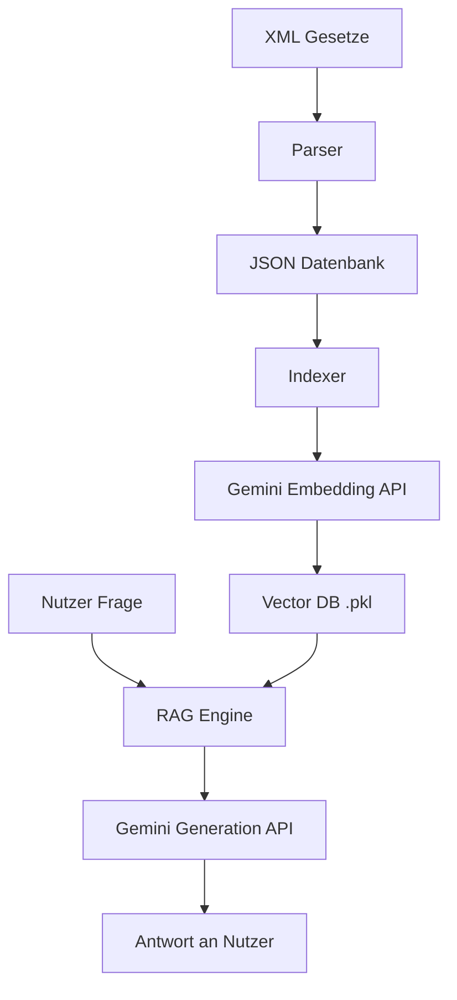

# Architektur des AI Lawyer German

Dieses Dokument beschreibt die technische Architektur und den Datenfluss des Systems.

## Komponenten

### 1. Datenakquise & Parsing (`src/parser.py`)
- **Input:** XML-Dateien von `gesetze-im-internet.de`.
- **Prozess:** Extraktion von Metadaten (Paragraph, Titel, Gesetz) und dem Volltext aus den `<norm>`-Tags.
- **Output:** Eine konsolidierte `all_laws_parsed.json`.

### 2. Indexierung (`src/indexer.py`)
- **Prozess:** 
  - Lädt die JSON-Daten.
  - Bildet Batches von Texten.
  - Sendet Texte an das Google Gemini Embedding Modell (`models/gemini-embedding-001`).
- **Output:** Eine `legal_embeddings.pkl` (Pickle), die eine Matrix aus Vektoren und zugehörige Metadaten enthält.

### 3. RAG Engine (`src/rag_engine.py`)
Dies ist das Herzstück des Systems. Der Ablauf einer Anfrage ist:
1. **Query Embedding:** Die Nutzeranfrage wird in einen Vektor umgewandelt.
2. **Vektorsuche:** Mittels Kosinus-Ähnlichkeit (`sklearn.metrics.pairwise.cosine_similarity`) werden die Top-N relevantesten Gesetzestexte aus der Pickle-Datei gefunden.
3. **Prompt Konstruktion:** Die gefundenen Texte werden zusammen mit dem Chat-Verlauf in einen System-Prompt eingebettet.
4. **Generierung:** Das Gemini Modell (`models/gemini-1.5-flash`) generiert basierend auf diesem Kontext eine fundierte Antwort.

### 4. CLI Interface (`main.py`)
- Nutzt die Bibliothek `rich` für eine ansprechende Terminal-Ausgabe.
- Verwaltet den Loop für interaktive Chats.
- Steuert das Session-Management.

## Datenfluss

## Technologien
- **Sprache:** Python 3.10+
- **KI/LLM:** Google Gemini SDK (`google-genai`)
- **Vektorsuche:** NumPy & Scikit-learn
- **UI:** Rich (Terminal)
- **Datenformat:** XML, JSON, Pickle
